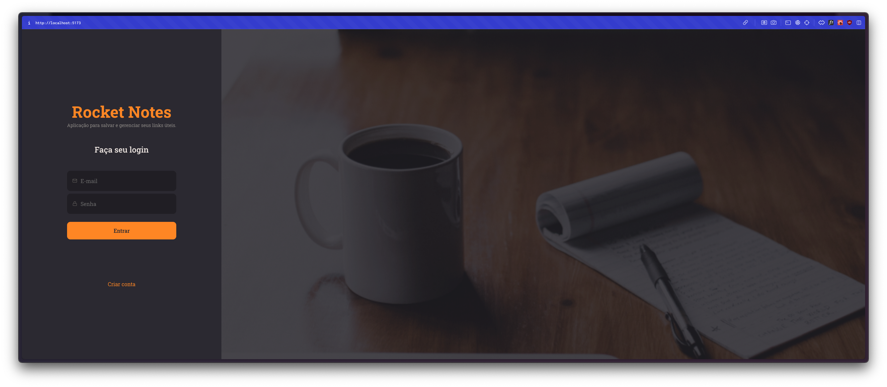

<h2 align="center">
  
</h2>

<p align="center">
  <a href="mailto:bortolettohenrique@gmail.com" target="_blank">
    
  </a>
  <a href="https://www.linkedin.com/in/henriquebortoletto/" target="_blank">
    
  </a>
</p>

---

### Pojeto Gerenciador de Notas

Aplicação de gerenciamento de notas, com as seguintes funcionalidades:

- [x] Usuário;
  - [x] Cadastrar;
  - [ ] Editar;
  - [ ] Excluir;
- [x] Notas;
  - [x] Cadastrar;
  - [x] Editar;
  - [x] Excluir;
- [x] Links;
  - [x] Cadastrar;
  - [x] Editar;
  - [x] Excluir;

### TODOS

- [ ] Traduzir os erros de ingles para portugues no frontend;

---

### Instalação

```bash
  # Clonar o repositório
  $ git clone

  # Entrar no diretório
  $ cd <pasta-do-projeto>

  # Instalar as dependências
  $ yarn ou npm install

  # Iniciar o projeto
  $ yarn dev ou npm run dev
```

---
